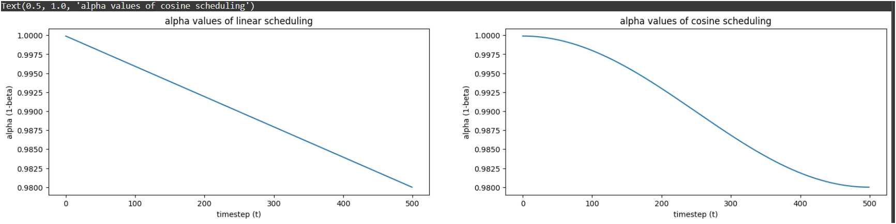

# 🌀 Diffusion Models 

## 📖 Overview
This project implements a **Diffusion Model** from scratch using **PyTorch** on the **CIFAR-10 dataset**.  
The model gradually adds and then removes noise from images to learn how to generate new, realistic samples.

## 💡 What are Diffusion Models?
Diffusion Models are **generative models** that learn to produce new data (like images) by **reversing a gradual noising process**.

- During training: noise is added to images step by step until they become pure noise.
- During generation: the model learns to **reverse** this process — starting from noise and reconstructing a clean image.

> Think of it like teaching a model how to “de-blur” an image perfectly, step by step.
>
> 
---

## 🧩 Steps in the Code

### 2️⃣ Dataset Preparation
- CIFAR-10 images are resized to **64×64** and normalized.  
- A custom `ImageDataset` class is used with caching for faster data loading.

### 3️⃣ Visualizing Sample Images
A grid of CIFAR-10 images is displayed to verify preprocessing.

### 4️⃣ Diffusion Utilities
Implements:
- Linear and cosine **beta schedulers**
 
 
- Noise addition using the formula:
\[
x_t = \sqrt{\alpha_t} \, x_0 + \sqrt{1 - \alpha_t} \, \epsilon
\]

- Sampling process for denoising

### 5️⃣ Model Architecture

#### 🧠 Encoder
- Based on **ResNet18**  
- Integrates **Sinusoidal Time Embeddings** and **Self-Attention** layers

#### 🧩 Decoder
- Mirrors the encoder using **Transpose Convolutions**  
- Reconstructs images from encoded features and timestep embeddings

#### 🔄 Combined
`DiffusionNet` connects Encoder + Decoder to predict noise.

---

### 6️⃣ Training Pipeline
Handles:
- Model initialization and weight setup  
- Forward pass with timestep sampling  
- MSE Loss between predicted and real noise  
- Optimization with **AdamW** and **Cosine Annealing LR Scheduler**

---

### 7️⃣ Model Saving & Testing
- Optionally loads pretrained weights if available  
- Tests model output dimensions  
- Displays GPU device info and total parameters

---

## 🧠 Key Classes & Components

| Class | Description |
|--------|-------------|
| `DiffusionUtils` | Handles beta scheduling, noising, and sampling |
| `Encoder` | Extracts features using ResNet backbone |
| `Decoder` | Reconstructs image from features |
| `DiffusionNet` | Connects encoder & decoder for full diffusion process |
| `TrainingPipeline` | Manages training loop, loss, and saving |

---

## 🧪 Output

Below is a visualization of the denoising process, showing the image at different noise steps (t):

| Step | Visualization |
|------|----------------|
| t = 0 | Original image |
| t = 100 | Partially noised |
| t = 300 | More noise |
| t = 500 | Almost full noise |

⬇️ **Generated Image (put your output image here)**  
*(you can upload your output image below)*  

---

## ⚙️ Configuration

| Parameter | Value |
|------------|--------|
| Image Size | 64×64 |
| Epochs | 20 |
| Learning Rate | 1e-4 |
| Scheduler | Cosine |
| Timesteps (T) | 500 |
| Batch Size | 10 |

---

## 🚀 Future Work
- Add sampling visualization during training  
- Experiment with different schedulers (exponential, quadratic)  
- Extend to higher-resolution datasets like CelebA or ImageNet

---

## 🧾 References
- Ho et al., *Denoising Diffusion Probabilistic Models (DDPM)*, 2020  
- Song et al., *Score-Based Generative Modeling*, 2021  
- PyTorch Documentation — [https://pytorch.org](https://pytorch.org)

